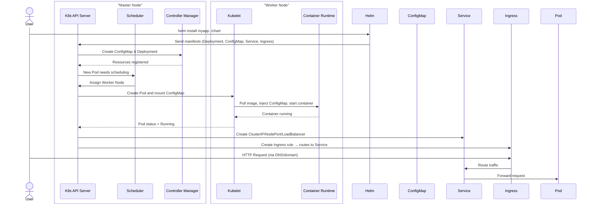

CKAD準備之State Persistence
===

## Table of Contents

[TOC]
## 準備技能




## Pod
### 基本概念
1. 建立一個名為'mynamespace'的 namespace，並部署一個  nginx pod
```gherkin=
kubectl create namespace mynamespace
#或 
kubectl create ns mynamespace
#使用方式 -n 等於 --namespace
kubectl run nginx --image=nginx --restart=Never -n mynamespace
```
2. 產出一個 pod 的 yaml 部署檔
```gherkin=
# kubectl run：部署 POD  
# --dry-run=client：只驗證與模擬產出
# -o yaml：導出 yaml 格式的部署檔  
kubectl run nginx --image=nginx --restart=Never --dry-run=client -n mynamespace -o yaml > pod.yaml
```
替代方式
```gherkin=
kubectl run nginx --image=nginx --restart=Never --dry-run=client -o yaml | kubectl create -n mynamespace -f -
```
3. 使用kubectl建立一個 busybox pod，再執行 env 指令，取得環境變數
```gherkin=
# -it : 可見輸出
# --rm ：執行完後，刪除 busybox
kubectl run busybox --image=busybox --command --restart=Never -it --rm -- env 
# -it will help in seeing the output, --rm will immediately delete the pod after it exits
# or, just run it without -it
kubectl run busybox --image=busybox --command --restart=Never -- env
# and then, check its logs
kubectl logs busybox

kubectl run busybox --image=busybox --command --restart=Never -it --rm

kubectl run busybox --image=busybox --command --restart=Never  --rm  

kubectl run busybox --image=busybox --restart=Never -it --rm


#***無法執行
kubectl run busybox --image=busybox --restart=Never -it --rm


```
4. 使用yaml檔建立一個 busybox pod，再執行 env 指令，取得環境變數
```gherkin=
# create a  YAML template with this command
kubectl run busybox --image=busybox --restart=Never --dry-run=client -o yaml --command -- env > envpod.yaml
```
```gherkin=
# 查看 it
cat envpod.yaml
```
> 內容如下
```gherkin=
apiVersion: v1
kind: Pod
metadata:
  creationTimestamp: null
  labels:
    run: busybox
  name: busybox
spec:
  containers:
  - command:
    - env
    image: busybox
    name: busybox
    resources: {}
  dnsPolicy: ClusterFirst
  restartPolicy: Never
status: {}
```
```gherkin=
 kubectl run busybox --image=busybox --restart=Never --dry-run=client -o yaml
```

```gherkin=
apiVersion: v1
kind: Pod
metadata:
  creationTimestamp: null
  labels:
    run: busybox
  name: busybox
spec:
  containers:
  - image: busybox
    name: busybox
    resources: {}
  dnsPolicy: ClusterFirst
  restartPolicy: Never
status: {}
```
> 觀察 containers
> 下面的參數都須以 - 號開始


5. 產出 namespace 的yaml檔，但不實際建立 namespace
```gherkin=
kubectl create namespace myns -o yaml --dry-run=client
```
>--dry-run=server 的差異？

```gherkin=
？？？

```

6. 產生一個資源額度名為 myrq 的 yaml 檔，限制使用1個CPU，1G記憶體與兩個pod，但是不實際部署
Get the YAML for a new ResourceQuota called 'myrq' with hard limits of 1 CPU, 1G memory and 2 pods without creating it
```gherkin=
kubectl create quota myrq --hard=cpu=1,memory=1G,pods=2 --dry-run=client -o yaml
```
7. 取得全部 namespaces 的 pods
```gherkin=
kubectl get po --all-namespaces
```
縮寫 --all-namespaces -> -A
```gherkin=
kubectl get po -A
```
8. 產出一個 nginx pod，並開放port 80
```gherkin=
kubectl run nginx --image=nginx --restart=Never --port=80
```
```gherkin=
# 雖然使用 --port，但是沒有出現任何 service
kubectl get svc -A
```
```gherkin=
kubectl get po nginx -o yaml
```
>內容如下
```gherkin=
apiVersion: v1
kind: Pod
metadata:
  creationTimestamp: "2023-11-15T13:15:03Z"
  labels:
    run: nginx
  name: nginx
  namespace: default
  resourceVersion: "5460"
  uid: 74a058b5-cee4-443f-8c60-709efe63ff39
spec:
  containers:
  - image: nginx
    imagePullPolicy: Always
    name: nginx
    ports:
    - containerPort: 80
      protocol: TCP
#.......................................      
```
#### Pod升級
> 改變一個nginx pod，指定版本為 1.7.1，並觀察鏡像下載與重啟
```gherkin=
# kubectl set image POD/POD_NAME CONTAINER_NAME=IMAGE_NAME:TAG
kubectl set image pod/nginx nginx=nginx:1.7.1
kubectl describe po nginx # you will see an event 'Container will be killed and recreated'
kubectl get po nginx -w # watch it
```
10. 從上一步驟的nginx中取得ip，使用一個臨時的 busybox鏡像，用 wget 取的 nginx 的 URL '/' 
```gherkin=
kubectl get po -o wide # get the IP, will be something like '10.1.1.131'
# create a temp busybox pod
kubectl run busybox --image=busybox --rm -it --restart=Never -- wget -O- 10.1.1.131:80
```
```gherkin=
# Get IP of the nginx pod
NGINX_IP=$(kubectl get pod nginx -o jsonpath='{.status.podIP}')
# create a temp busybox pod
kubectl run busybox --image=busybox --env="NGINX_IP=$NGINX_IP" --rm -it --restart=Never -- sh -c 'wget -O- $NGINX_IP:80'

```
```gherkin=
kubectl run busybox --image=busybox --rm -it --restart=Never -- wget -O- $(kubectl get pod nginx -o jsonpath='{.status.podIP}:{.spec.containers[0].ports[0].containerPort}')
```
11. Get pod's YAML
```gherkin=
kubectl get po nginx -o yaml
# or
kubectl get po nginx -oyaml
# or
kubectl get po nginx --output yaml
# or
kubectl get po nginx --output=yaml
```
12. Get information about the pod, including details about potential issues (e.g. pod hasn't started)
```gherkin=
kubectl describe po nginx
```
13. Get pod logs
```gherkin=
kubectl logs nginx
```
14. 如果 pod 已經損毀，可用 --previous 參數，取得損毀前的日誌
If pod crashed and restarted, get logs about the previous instance
```gherkin=
kubectl logs nginx -p
# or
kubectl logs nginx --previous
```
15. 登入 pod 並執行 shell
Execute a simple shell on the nginx pod
```gherkin=
kubectl exec -it nginx -- /bin/sh
```
16. 產生一個 busybox，並印出 hello world 再退出
Create a busybox pod that echoes 'hello world' and then exits
```gherkin=
kubectl run busybox --image=busybox -it --restart=Never -- echo 'hello world'
# or
kubectl run busybox --image=busybox -it --restart=Never -- /bin/sh -c 'echo hello world'
```
17. Do the same, but have the pod deleted automatically when it's completed
```gherkin=
kubectl run busybox --image=busybox -it --rm --restart=Never -- /bin/sh -c 'echo hello world'
kubectl get po # nowhere to be found :)
```
18. Do the same, but have the pod deleted automatically when it's completed
```gherkin=
kubectl run nginx --image=nginx --restart=Never --env=var1=val1
# then
kubectl exec -it nginx -- env
# or
kubectl exec -it nginx -- sh -c 'echo $var1'
# or
kubectl describe po nginx | grep val1
# or
kubectl run nginx --restart=Never --image=nginx --env=var1=val1 -it --rm -- env
# or
kubectl run nginx --image nginx --restart=Never --env=var1=val1 -it --rm -- sh -c 'echo $var1'
```
### Pod 生命週期

### initPod

### static Pod

### Node Select
> 在 node 上標註 key=value：diskxxx=ssdxx
```gherkin=
kubectl label node mnode-worker2 diskxxx=ssdxx
```
> 在 pod 的 spec 下
```gherkin=
apiVersion: v1
kind: Pod
metadata:
  creationTimestamp: null
  labels:
    run: node-selector
  name: node-selector
spec:
  nodeSelector:
    diskxxx: ssdxx
  containers:
  - image: nginx
    name: node-selector
    resources: {}
  dnsPolicy: ClusterFirst
  restartPolicy: Always
status: {}
```

### Node的cordon與drain

### Node的Taint與Pod的Toleration


## Deployment
### 建立一個 deployment
#### 以指令方式
```gherkin=
kubectl create deploy nginx --image=nginx --restart=Never
```
#### 以 yaml 檔方式
```gherkin=
cd deploy
```

```gherkin=
kubectl create deploy nginx --image=nginx --dry-run=client -o yaml > depl-nginx.yaml
```
```gherkin=
kubectl apply -f depl-nginx.yaml
```

```gherkin=
kubectl get deploy -w -o wide
```

### 修改已經部署的 deployment
#### 修改檔案後再 apply
```gherkin=
vim depl-nginx.yaml
```

```gherkin=
kubectl apply -f depl-nginx.yaml
```
#### 直接以指令修改
```gherkin=
kubectl edit deploy nginx
```

### 刪除已經部署的 deployment
#### 
```gherkin=
kubectl delete deploy nginx
# 或是
kubectl delete -f depl-nginx.yaml
```

## Service
### Pod Expose
```gherkin=
kubectl run pod-nginx --image=nginx
```
```gherkin=
kubectl expose pod pod-nginx --name=pod-nginx-svc --port=80 --target-port=80 --dry-run=client -o yaml > svc-nginx-pod.yaml
```

### Deployment Expose
```gherkin=
kubectl create deploy depl-nginx --image=nginx
```
```gherkin=
kubectl expose deploy depl-nginx --name=svc-nginx-depl --port=80 --target-port=80 > svc-nginx-depl.yaml

# 查看 depl-nginx-svc 細節，確認 Endpoint 為 10.244.4.3
kubectl describe svc  depl-nginx-svc
```


> 由於我們使用 Default Service Type(為ClusterIP)，所以我們要進到K8s Cluster的任何一個節點
> 因為這個K8s是部署在 Docker 裡，所以後面登入節點的程序，即為登入 Docker container的程序
```gherkin=
docker ps -a
```

> 確認 container 4b3613143ef9 是我們要登入的K8s 節點，使用指令如下
```gherkin=
docker exec -it 4b3613143ef9 /bin/bash
```
> 用 curl 查詢 depl-nginx-svc 的 Endpoint
```gherkin=
curl -s 10.244.4.3 
```


## Network
### Ingress
### Egress

## Probe
### Liveness Probe
#### command
#### httpGet
#### tcpSocket
### Readiness Probe


## Volume
```
kubectl run busybox --image=busybox --restart=Never -o yaml --dry-run=client -- /bin/sh -c 'sleep 3600' > vol-pod.yaml
vi vol-pod.yaml
```

```typescript=
apiVersion: v1
kind: Pod
metadata:
  creationTimestamp: null
  labels:
    run: busybox
  name: busybox
spec:
  dnsPolicy: ClusterFirst
  restartPolicy: Never
  containers:
  - args:
    - /bin/sh
    - -c
    - sleep 3600
    image: busybox
    imagePullPolicy: IfNotPresent
    name: busybox
    resources: {}
    volumeMounts: #
    - name: myvolume #
      mountPath: /etc/foo #
  - args:
    - /bin/sh
    - -c
    - sleep 3600
    image: busybox
    name: busybox2 # don't forget to change the name during copy paste, must be different from the first container's name!
    volumeMounts: #
    - name: myvolume #
      mountPath: /etc/foo #
  volumes: #
  - name: myvolume #
    emptyDir: {} #
```
>登入第二個 container
```
kubectl exec -it busybox -c busybox2 -- /bin/sh
cat /etc/passwd | cut -f 1 -d ':' > /etc/foo/passwd 
cat /etc/foo/passwd # confirm that stuff has been written successfully
exit
```
>登入第一個 container
```
kubectl exec -it busybox -c busybox -- /bin/sh
mount | grep foo # confirm the mounting
cat /etc/foo/passwd
exit
kubectl delete po busybox
```
### PersistentVolume
>myvolume
```typescript=
kind: PersistentVolume
apiVersion: v1
metadata:
  name: myvolume
spec:
  storageClassName: normal
  capacity:
    storage: 10Gi
  accessModes:
    - ReadWriteOnce
    - ReadWriteMany
  hostPath:
    path: /etc/foo
```
>另一個例子，pv0003.yaml
```typescript=
apiVersion: v1
kind: PersistentVolume
metadata:
  name: pv0003
spec:
  capacity:
    storage: 5Gi
  volumeMode: Filesystem
  accessModes:
    - ReadWriteOnce
  persistentVolumeReclaimPolicy: Recycle
  storageClassName: slow
  mountOptions:
    - hard
    - nfsvers=4.1
  nfs:
    path: /tmp
    server: 172.17.0.2:wq
```

```
kubectl create -f myvolume.yaml
# will have status 'Available'
kubectl get pv
```
### PersistentVolumeClaim
```typescript=
kind: PersistentVolumeClaim
apiVersion: v1
metadata:
  name: mypvc
spec:
  storageClassName: normal
  accessModes:
    - ReadWriteOnce
  resources:
    requests:
      storage: 4Gi
```

```
kubectl create -f mypvc.yaml
```
```
kubectl get pvc # will show as 'Bound'
kubectl get pv # will show as 'Bound' as well
```

### 使用 PVC
```
kubectl run busybox --image=busybox --restart=Never -o yaml --dry-run=client -- /bin/sh -c 'sleep 3600' > pod.yaml
vi pod.yaml
```
```typescript=
apiVersion: v1
kind: Pod
metadata:
  creationTimestamp: null
  labels:
    run: busybox
  name: busybox
spec:
  containers:
  - args:
    - /bin/sh
    - -c
    - sleep 3600
    image: busybox
    imagePullPolicy: IfNotPresent
    name: busybox
    resources: {}
    volumeMounts: #
    - name: myvolume #
      mountPath: /etc/foo #
  dnsPolicy: ClusterFirst
  restartPolicy: Never
  volumes: #
  - name: myvolume #
    persistentVolumeClaim: #
      claimName: mypvc #
status: {}
```

```
kubectl create -f pod.yaml
kubectl exec busybox -it -- cp /etc/passwd /etc/foo/passwd
```
### 編輯
```
vim pod.yaml
# change 'metadata.name: busybox' to 'metadata.name: busybox2'
kubectl create -f pod.yaml
kubectl exec busybox2 -- ls /etc/foo # will show 'passwd'
# cleanup
kubectl delete po busybox busybox2
```
```
# check which nodes the pods are on
kubectl get po busybox -o wide
kubectl get po busybox2 -o wide
```
```
kubectl run busybox --image=busybox --restart=Never -- sleep 3600
kubectl cp busybox:etc/passwd ./passwd # kubectl cp command
# previous command might report an error, feel free to ignore it since copy command works
cat passwd
```
### hostPath

### NFS

### storageClass


## Configuration
### ConfigMap

### Secret


## Schedule
### Job

### CronJob

## Kustomize

## Helm

## Appendix and FAQ

:::info
**Find this document incomplete?** Leave a comment!
:::

###### tags: `Kubernetes` `CKAD` `Documentation`
